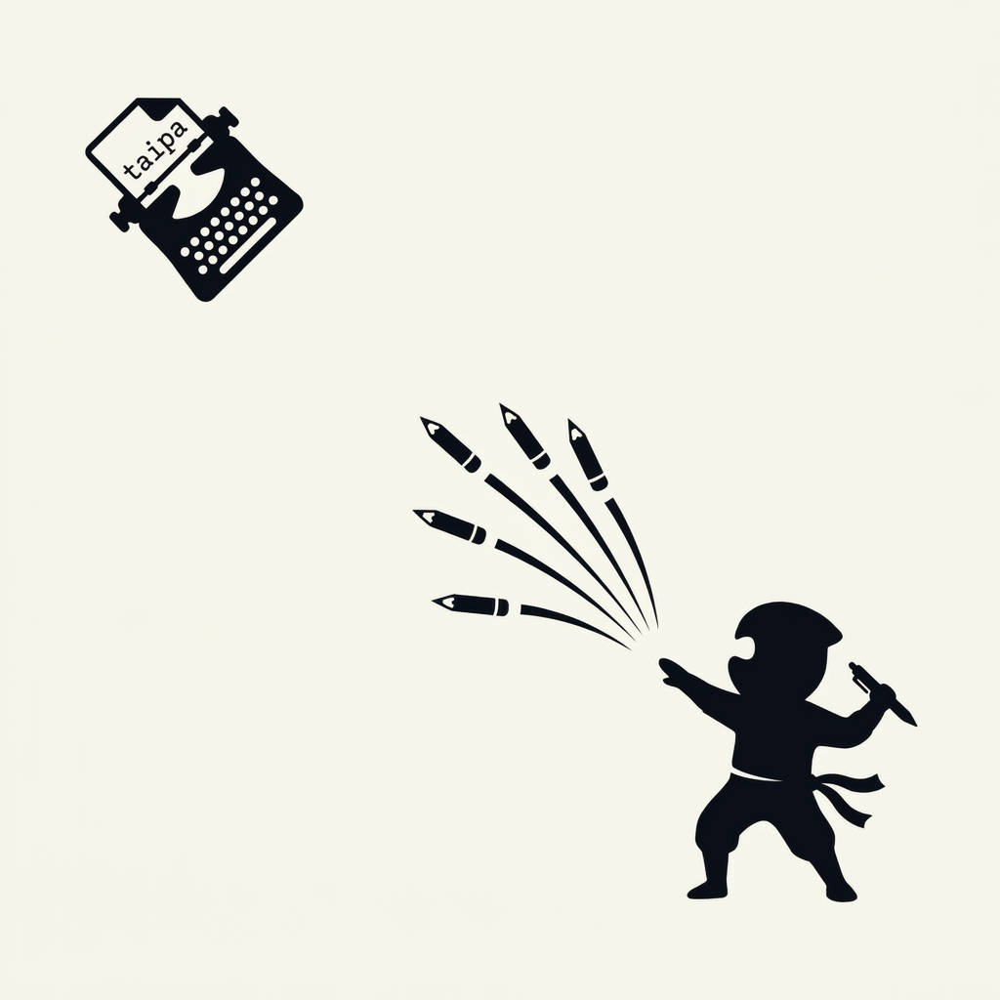

<p align="center">
  
</p>

<h1 align="center">Taipa</h1>

<p align="center">
  <strong>A writing and document studio.</strong>
</p>

---

Taipa is a desktop-first writing studio for novels, manga, screenplays, poetry, and journals — plus a document workspace for LaTeX book projects with compile, PDF preview, and a whole-book reader. Everything stays local on disk by default.

Built on Electron + React with editors and viewers from [npcts](https://github.com/npc-worldwide/npcts).

### Highlights

- **Writing projects** — Create novels, stories, manga, screenplays, poetry, and journals. Each project has chapters, an outline, characters, notes, word goals, and a cover.
- **Rich editors** — Distraction-free editors for each project type, powered by the npcts `NovelEditor`, `MangaEditor`, `ScreenplayEditor`, `PoetryEditor`, and `JournalEditor`.
- **LaTeX book projects** — Open a folder as a book project. Edit chapters with a live LaTeX compile bar and split PDF preview, or switch to the whole-book reader.
- **Whole-book reader** — Assembles a LaTeX book by following `\input{}`/`\include{}` references, converts LaTeX to readable HTML, and provides search with match navigation.
- **Project library** — A launcher grid of recent folder-based book projects and in-app writing projects with progress bars and quick open.
- **Import / export** — Import writing projects from JSON; export to Markdown or JSON.
- **Git** — A Git panel for folder-based book projects (status, diff, commit) without leaving the editor.
- **Local-first** — Your writing and projects stay on disk. Writing projects persist to `localStorage`; book projects live as files in their folder.

---

## Setup

### Install

Download the installer for your platform from the releases page, run it, and launch Taipa. macOS (`.dmg`), Windows (`.exe`), and Linux (`.deb`/`.AppImage`) builds are provided.

### First launch

Taipa opens to the **Projects** library. Open a LaTeX book folder with the *Open Folder* button, or create a new in-app writing project from the *New Project* modal.

### Writing projects

Choose a type (novel, story, manga, screenplay, poetry, journal), set a title and word goal, and start writing. Use the sidebar to switch between Chapter, Outline, Characters, and Notes views. Export to Markdown or JSON from the project settings.

### LaTeX book projects

Open a folder containing a root `.tex` document. Use the **Edit / Book** toggle to switch between the whole-book editor (with LaTeX compile + PDF preview) and the read-only whole-book reader.

---

## Development setup

### Prerequisites

- Node.js 22+ and npm
- (Optional) A LaTeX distribution for book project compilation

### Install

```bash
git clone https://github.com/npc-worldwide/taipa.git
cd taipa
npm install --legacy-peer-deps
```

### Run

```bash
npm run dev
```

### Build

```bash
npm run build
```

This builds the renderer, Electron main, and preload scripts, then packages the app with electron-builder. To package for a specific platform:

```bash
npx electron-builder --mac
npx electron-builder --win
npx electron-builder --linux
```

---

## Community

- **Issues & Bugs**: [GitHub Issues](https://github.com/npc-worldwide/taipa/issues)
- **NPC Ecosystem**: [npcpy](https://github.com/npc-worldwide/npcpy) | [npcsh](https://github.com/npc-worldwide/npcsh) | [npcts](https://github.com/npc-worldwide/npcts)

## License

Taipa is licensed under the MIT License. See the [LICENSE](LICENSE) file for details.